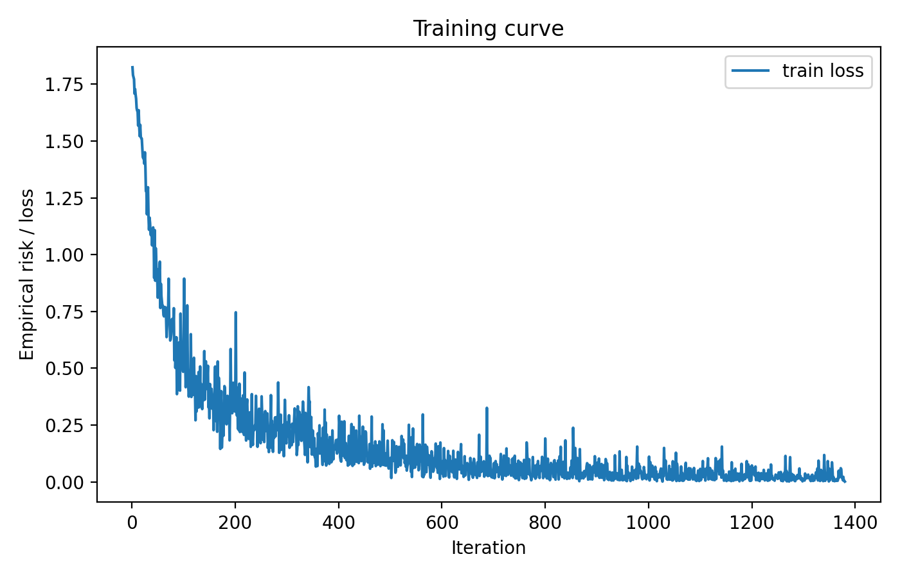

# DSC 140B Final Project Report

## SoCalGuessr Model Report

## **Human Baseline**

I evaluated myself on the SoCalGuessr human baseline game at `https://eldridgejm.github.io/SoCalGuessr/`. My final score was **19/50 = 38%**. The confusion matrix screenshot from that run is shown below. The human baseline is much lower than the model validation accuracy, which suggests that the learned visual features are capturing location cues that are difficult to identify consistently by hand.

## **Final Model Architecture**

My final model is a **pretrained EfficientNet-B0** implemented with `torchvision`. I used the ImageNet-pretrained EfficientNet-B0 backbone and replaced the final classifier so that the model outputs logits for the six city classes: Anaheim, Bakersfield, Los Angeles, Riverside, SLO, and San Diego. In code, the final classifier is changed from the default 1000-way ImageNet classifier to a new linear layer with input dimension 1280 and output dimension 6.

For the task-specific head, the model has **no additional hidden fully connected layers**. The custom classifier is a single linear layer mapping the 1280-dimensional EfficientNet feature vector to 6 output logits. Thus, the task-specific head has:

- **Hidden layers:** 0 additional hidden fully connected layers
- **Final linear layer:** 1280 → 6

The total number of parameters in the final model is approximately **4.02 million parameters**. This comes from the standard `torchvision` EfficientNet-B0 parameter count with the original 1000-class classifier replaced by a 6-class linear layer. All parameters were trainable, since I did not enable backbone freezing in the training command.

The activations used in the model are the standard **SiLU (Swish)** nonlinearities inside the EfficientNet-B0 backbone. The final classifier layer is linear and does not apply a separate output activation. During training, the loss function is cross-entropy, which applies the softmax normalization implicitly when computing the loss.

## **Training Procedure**

I trained the model using the provided training images, where the class label is extracted from the filename prefix before the first hyphen. I used an **80/20 stratified train/validation split** with random seed 42 so that each city remains represented in both partitions. The final training run used the following command:

```bash
python train.py --data-dir data --arch efficientnet_b0 --epochs 12 --batch-size 64 --lr 1e-4
```

The model was trained with Adam and cross-entropy loss for 12 epochs using a learning rate of 1e-4, weight decay 1e-4, batch size 64, and image size 224 x 224. Training was run on CPU.

For preprocessing, all images were resized to 224 x 224. During training, I applied random horizontal flipping and color jitter, followed by ImageNet normalization. During validation and inference, I used resizing plus ImageNet normalization only. The model checkpoint with the highest validation accuracy was saved automatically during training.

The best validation accuracy achieved during training was 0.9200 (92.00%). The validation accuracy improved steadily through the middle epochs and then leveled off, while the training loss continued decreasing, which suggests mild late-stage overfitting. The best checkpoint was therefore selected based on validation accuracy rather than simply using the final epoch.

Training time: The training code was run on CPU and took approximately 8 hours 49 minutes of wall-clock time (8:48:56.94 total).

The training curve is shown below. In the current training code, the curve is recorded as iteration number versus empirical risk, where empirical risk is the mini-batch cross-entropy loss collected during training.



In summary, the final system uses a pretrained EfficientNet-B0 backbone with a 6-class linear classifier, trained with Adam and cross-entropy loss on a stratified train/validation split. The final validation result of 92.00% suggests that the model learned strong visual cues for distinguishing Southern California cities.
